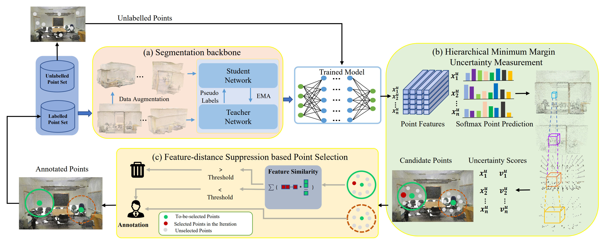

# Hierarchical Point-based Active Learning for Semi-supervised Point Cloud Semantic Segmentation (ICCV 2023)

This is the official repository for **Hierarchical Point-based Active Learning for Semi-supervised Point Cloud
Semantic Segmentation** [[arXiv](https://arxiv.org/abs/2308.11166)][[CVF](https://openaccess.thecvf.com/content/ICCV2023/html/Xu_Hierarchical_Point-based_Active_Learning_for_Semi-supervised_Point_Cloud_Semantic_Segmentation_ICCV_2023_paper.html)]



## Environmental Setup

- OS: Ubuntu 22.04
- CUDA: 11.7
- Conda environment (You can also refer to [ReDAL](https://github.com/tsunghan-wu/ReDAL) for some details. Our code is modified on their codes. We thank the authors for sharing the codes.):
```shell
conda create -n HPAL python=3.6 -y
conda install pytorch==1.8.0 torchvision==0.9.0  cudatoolkit=11.1 -c pytorch -c conda-forge -y
conda install pytorch-scatter -c pyg -y
conda install scikit-learn=0.24.2 -y
conda install pyyaml=5.3.1 -y
conda install tqdm=4.61.1 -y
conda install pandas=1.3.2 -y
conda install pyntcloud -c conda-forge -y
conda install plyfile -c conda-forge -y
conda install cython -y
conda install h5py==2.10.0 -y
pip3 install open3d-python==0.3.0
pip3 install --upgrade git+https://github.com/mit-han-lab/torchsparse.git@v1.2.0 (depend on libsparsehash-dev)
install libsparsehash-dev (no sudo permissions):
      git clone https://github.com/sparsehash/sparsehash.git
      cd sparsehash
      ./configure --prefix=/path/you/want/local
      make
      make install
      gedit(vim) ~/.bashrc
      export CPLUS_INCLUDE_PATH=/path/you/want/local/include
      source ~/.bashrc
install libsparsehash-dev (with sudo permissions):
      sudo apt-get install libsparsehash-dev
```
- Compile cpp-related utils:
```shell
sh compile_op.sh
```

## Data preparation

1. Fill the [google form](https://docs.google.com/forms/d/e/1FAIpQLScDimvNMCGhy_rmBA2gHfDu3naktRm6A8BPwAWWDv-Uhm6Shw/viewform) to get the dataset download link (download **Stanford3dDataset_v1.2_Aligned_Version.zip**)

2. S3DIS Data Preprocessing
    1. extract **"Stanford3dDataset_v1.2_Aligned_Version.zip"**.
    2. Modify ```STANFORD_3D_IN_PATH``` and ```STANFORD_3D_OUT_PATH``` in ```data_preparation/data_prepare_s3dis.py``` and run it:
    ```shell
    python3 data_prepare_s3dis.py
    ```

After that, the file organization will be like:

```shell
S3DIS/
├── Area_1
│   ├── coords
│   │   ├── conferenceRoom_1.npy
│   │   ...
│   ├── labels
│   │   ├── conferenceRoom_1.npy
│   │   ...
│   ├── rgb
│   │   ├── conferenceRoom_1.npy
│   │   ...
│   └── proj
│       ├── conferenceRoom_1.pkl
│       ...
├── Area_2
...

```


## Training and inference
#### A. Active semi-supervised training (Our method):
1. Build the initial labelled data (Randomly labeling a small part of data):
   1. Modify ```root``` in ```init_labeled_points_s3dis.py``` to processed data path.
   2. Modify ```save_path``` in ```init_labeled_points_s3dis.py``` to your desired result save path.
   3. Modify ```labeled_num_cur_pc``` in ```init_labeled_points_s3dis.py``` to the number of initial labelled points for each point cloud.
   4. Run ```init_labeled_points_s3dis.py```:
   ```shell
   python init_labeled_points_s3dis.py
   ```
Then in your ```save_path```, you can get a dictionary that each item saves a boolean array to stand whether each point is labelled. 

You can also get the initial labelled data that we use for the reported experiments in our paper by downloading from [google drive](https://drive.google.com/drive/folders/1tmy_prHYUa4NVFzcpGqZR4bMXpzA-6Qp?usp=drive_link). The number of initial labelled data are 1/5 of the total labelling budget in each setting.

2. Modify configuration parameters under ```class ConfigS3DIS``` in ```config.py```, change of the following parameters is necessary:
   ```shell
   data_path = '/your_data_path'  # Data root path after preparation
   init_labeled_data = '/initial_data_index'  # Path of initial labeled data dictionary
   base_path = '/results'  # Path to save the training results
   active_strategy = 'HMMU' # Scoring strategy for active learning
   chosen_rate_AL = 0.02 # The percentage of selected points in each iteration, which is 1/5 of the total labeling budget in our setting.
   ```
   
3. Training:
   ```shell
   python s3dis_main.py --test_area 5 --mode AL_train
   ```

#### B. Fully supervised Training (Upperbound):
   ```shell
   python s3dis_main.py --test_area 5 --mode baseline_train 
   ```
   
#### C. Inference (Test any trained model):
You can test any trained model by following steps:
   1. Get a trained model and save it to disk.
   2. Run ```s3dis_main.py```:
```shell
python s3dis_main.py --mode test --model_path the/path/of/the/trained/model
```

## Pretrained Models

We provide pretrained models for reported results in our paper, you can download them through following links:

| label setting |    0.02%     |    0.07%     |     0.43%     |
|:-------------:|:------------:|:------------:|:-------------:|
|    mIoU(%)    |     55.9     |     62.3     |   **65.7**    |
|     link      | [download](https://drive.google.com/file/d/1Sks2VfKj8NKq24I6GR42umalhR2ItpFC/view?usp=drive_link) |   [download](https://drive.google.com/file/d/14GhtuqzzcZ0-lzb3DgHNyiEgWEPqa78i/view?usp=drive_link)   |   [download](https://drive.google.com/file/d/1pnFpjYU5B2xzYxt7pZrT2rEQqFSdHhQB/view?usp=drive_link)    |
   

## Visualization


## Paper and Citation

If you find our paper is useful, please cite:
```shell
@InProceedings{Xu_2023_ICCV,
    author    = {Xu, Zongyi and Yuan, Bo and Zhao, Shanshan and Zhang, Qianni and Gao, Xinbo},
    title     = {Hierarchical Point-based Active Learning for Semi-supervised Point Cloud Semantic Segmentation},
    booktitle = {Proceedings of the IEEE/CVF International Conference on Computer Vision (ICCV)},
    month     = {October},
    year      = {2023},
    pages     = {18098-18108}
}
```
